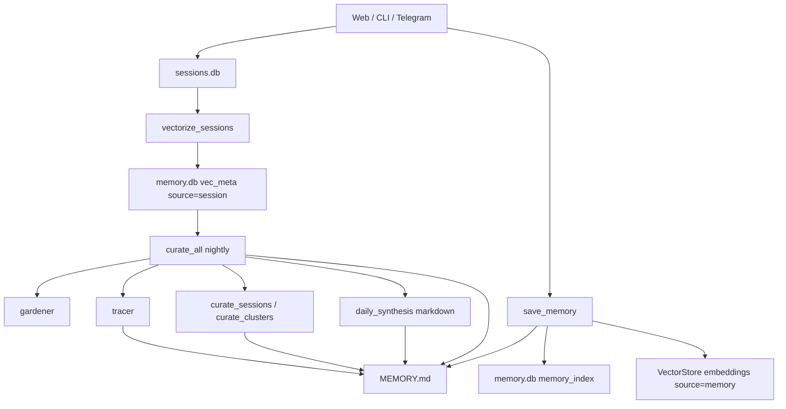
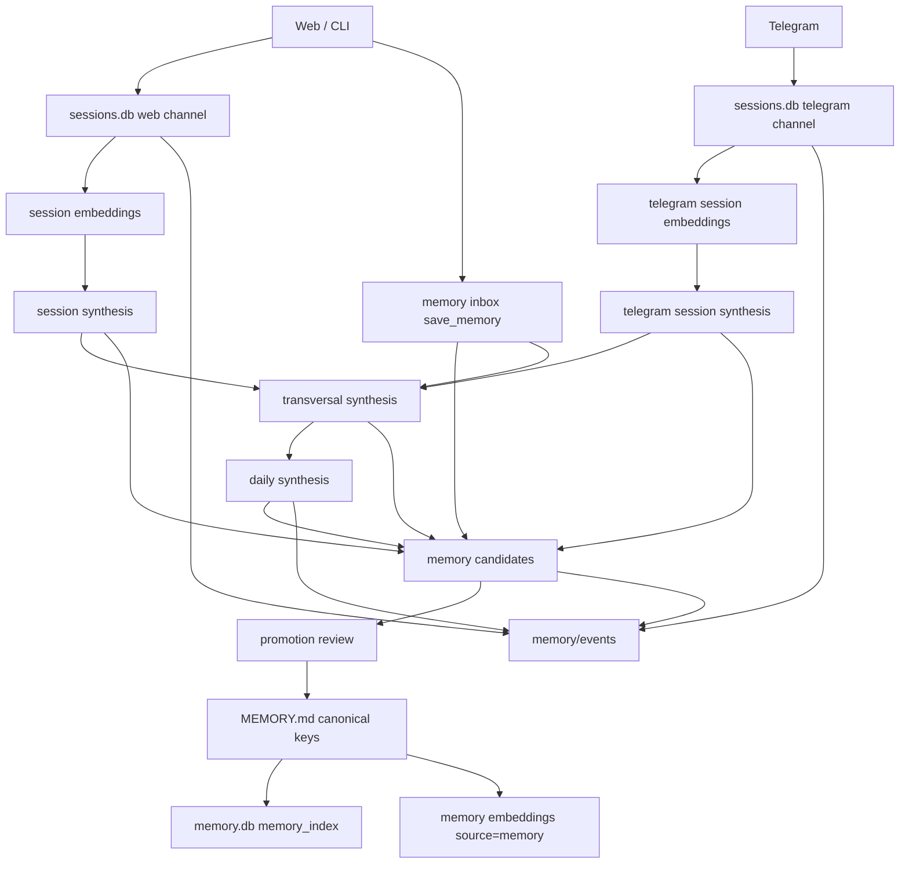
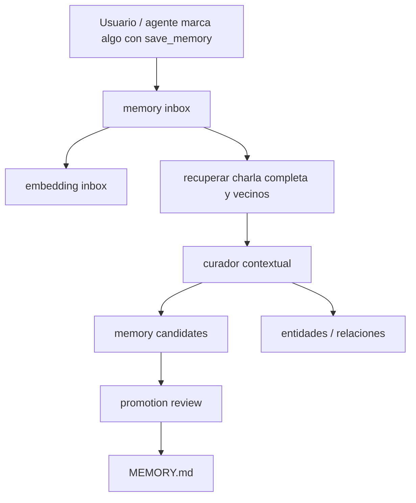
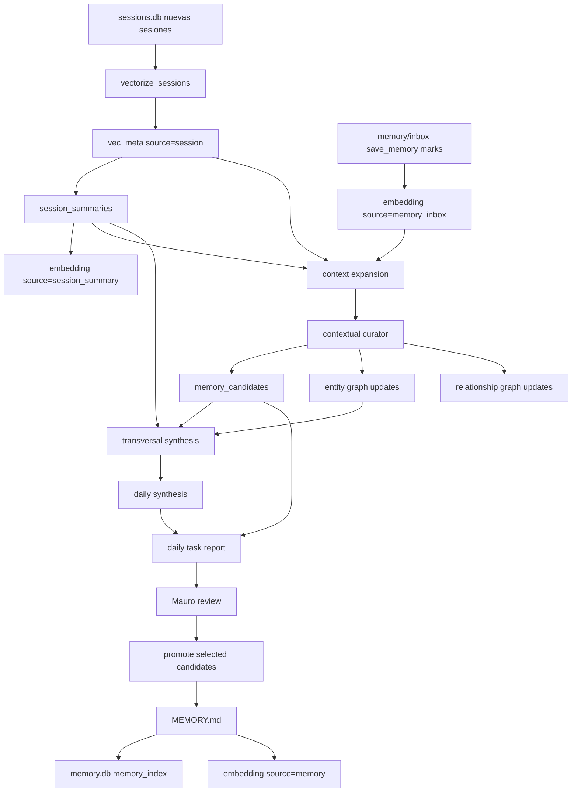
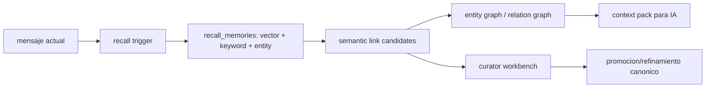

# Roadmap: memoria por capas para Kairos

Fecha: 2026-07-02

## Objetivo

Separar la memoria de Kairos en capas con responsabilidades claras:

- eventos crudos y actividad diaria;
- sintesis por sesion;
- sintesis transversal entre sesiones;
- sintesis diaria completa;
- inbox diaria de memoria marcada por `save_memory`;
- candidatos de memoria promovibles;
- `MEMORY.md` como memoria canonica, estable y humana;
- embeddings sobre cada capa para busqueda, recall y curaduria.

La meta no es guardar menos. Es guardar mejor: que la memoria nocturna haga mas trabajo, pero sin convertir `MEMORY.md` en un log que rompe git, pull, laptop y sincronizacion LAN.

## Problema actual

Hoy `MEMORY.md` cumple dos roles mezclados:

1. Memoria canonica: preferencias, decisiones, patrones estables, estado del proyecto.
2. Telemetria generada: checkpoints de curacion, synthesis diaria, patrones detectados, timestamps nocturnos.

Eso genera friccion:

- PC y laptop modifican `MEMORY.md` de forma independiente.
- `git pull` en laptop puede crear autostash o conflicto.
- La curacion nocturna mete ruido operativo en el mismo archivo que se inyecta al prompt.
- `memory.db` y embeddings quedan atados a un archivo que tambien funciona como log.
- Telegram, web y futuras tareas programadas no tienen un lugar comun para dejar eventos sin "promoverlos" a memoria canonica.

## Flujo actual simplificado



El punto delicado: muchas salidas generadas terminan escribiendo `MEMORY.md`.

## Flujo propuesto



## Capas propuestas

### 1. Eventos

Destino:

- `memory/events/YYYY/MM/DD/*.jsonl` o `.md`

Contenido:

- ejecucion de curador;
- checks;
- errores;
- stashes detectados;
- preflight local/remoto;
- referencias a artifacts generados;
- actividad de canales.

Propiedad:

- No es memoria canonica.
- No se inyecta completa al prompt.
- Puede estar fuera de git o sincronizarse por nodo.
- Puede tener TTL o compactacion.

Beneficio:

- El sistema puede observarse sin ensuciar `MEMORY.md`.

### 2. Sintesis por sesion

Destino:

- `memory/session_summaries/{channel}/{session_id}.md`
- o tabla futura `session_summaries`.

Contenido:

- resumen breve;
- participantes/canal;
- temas;
- decisiones;
- bugs mencionados;
- acciones pendientes;
- calidad de extraccion;
- hash del contenido fuente.

Entradas:

- `sessions.db`;
- mensajes web/CLI;
- mensajes Telegram;
- tool calls relevantes.

Embeddings:

- `source=session_summary`;
- `source_key=session_id`;
- `content_hash=hash(summary)`;
- pipeline: `session_summary_embedding`.

Beneficio:

- Recall mas barato que buscar sobre todos los mensajes.
- Base para sintesis transversal.
- Permite borrar/archivar sesiones crudas sin perder sentido.

### 3. Sintesis transversal

Destino:

- `memory/transversal/YYYY/MM/DD.md`
- o tabla futura `transversal_synthesis`.

Contenido:

- patrones entre sesiones;
- temas repetidos;
- bugs recurrentes;
- preferencias emergentes;
- decisiones que aparecen en mas de un canal;
- contradicciones entre memoria vieja y conversaciones nuevas.

Entradas:

- sintesis por sesion;
- clusters;
- entidades;
- retrieval hibrido;
- Telegram + web + CLI.

Embeddings:

- `source=transversal_synthesis`;
- `source_key=YYYY-MM-DD`;
- pipeline: `transversal_synthesis_embedding`.

Beneficio:

- Detecta lo que una sola sesion no ve.
- Baja ruido antes de promover a memoria canonica.

### 4. Sintesis diaria

Destino actual:

- `memory/synthesis/YYYY/MM/DD.md`

Destino recomendado:

- mantener ese path, pero enriquecerlo.

Contenido:

- top temas del dia;
- sesiones procesadas;
- decisiones;
- bugs;
- tareas sugeridas;
- puntos para retomar hoy;
- candidatos de memoria;
- estado de pipeline;
- estado PC/laptop;
- estado Telegram.

Embeddings:

- `source=daily_synthesis`;
- `source_key=YYYY-MM-DD`;
- pipeline: `daily_synthesis_embedding`.

Beneficio:

- La tarea diaria puede leer un artifact estable en vez de reconstruir todo.
- Kairos puede responder "que paso ayer" sin revisar miles de mensajes.

### 5. Inbox diaria de memoria

Idea:

`save_memory` deja de ser necesariamente "guardar para siempre en `MEMORY.md`" y pasa a ser tambien "marcar algo importante del dia para que los curadores lo investiguen con contexto completo".

Destino recomendado:

- `memory/inbox/YYYY/MM/DD.jsonl`;
- tabla futura `memory_inbox`;
- embedding source: `memory_inbox`.

Campos sugeridos:

```json
{
  "inbox_id": "hash",
  "key": "user:workflow",
  "value": "Mauro quiere que save_memory sea inbox temporal de alta senal.",
  "session_id": "current-session",
  "channel": "web|telegram|cli",
  "message_ref": "message-id-or-turn",
  "created_at": "2026-07-02T09:00:00",
  "status": "pending|linked|promoted|rejected|expired",
  "urgency": "normal|high",
  "source": "save_memory"
}
```

Regla conceptual:

- `save_memory` captura intencion y relevancia local.
- El curador NO debe copiar esa key a `MEMORY.md` sin leer contexto.
- El curador debe volver a la sesion completa, entender de donde salio esa key, comparar con memoria existente y recien ahi decidir que extraer.
- Si la key era un apunte temporal, queda como evento/inbox y no entra al canon.
- Si la key expresa una verdad estable, se transforma en candidato promovible.

Flujo:



Beneficio:

- `save_memory` sigue siendo rapido durante la charla.
- El sistema no toma cada save como canon inmediato.
- Los curadores ganan una lista priorizada de cosas importantes para estudiar de noche.
- Los embeddings se crean sobre material sintetizado y correctamente contextualizado, no solo sobre frases sueltas.

### 6. Candidatos de memoria

Destino:

- `memory/candidates/YYYY/MM/DD.jsonl`
- o tabla futura `memory_candidates`.

Campos sugeridos:

```json
{
  "candidate_id": "hash",
  "key": "user:workflow",
  "value": "2026-07-02 09:00 | ...",
  "source": "session_summary",
  "source_key": "session-id",
  "channel": "web",
  "confidence": 0.82,
  "reason": "repeated preference",
  "status": "pending|promoted|rejected|superseded",
  "created_at": "2026-07-02T09:00:00"
}
```

Regla:

- Los curadores generan candidatos.
- `MEMORY.md` recibe solo candidatos promovidos.
- La promocion puede ser manual al principio.
- Despues puede ser semiautomatica con reglas conservadoras.

Beneficio:

- Se conserva todo lo valioso sin escribir automaticamente al canon.
- Reduce conflictos entre nodos.

### 7. MEMORY.md canonico

Rol:

- Verdades duraderas;
- preferencias del usuario;
- decisiones arquitectonicas vigentes;
- estado importante del proyecto;
- patrones estables;
- cosas que merecen estar en el prompt inicial.

No deberia recibir automaticamente:

- checkpoints diarios;
- synthesis refs;
- logs de curador;
- patrones de baja confianza;
- actividad temporal;
- telemetria de preflight.

Regla de promocion:

- Si afecta comportamiento futuro del asistente: candidato a `MEMORY.md`.
- Si solo explica que paso: artifact/evento.
- Si solo sirve para debug: evento/log.

## Sistemas enlazados y beneficios

### Web / CLI

Beneficios:

- sesiones resumidas;
- recall mas preciso;
- menos dependencia de historial largo;
- mejor continuidad entre dias.

### Telegram

Beneficios:

- mismo pipeline que web;
- sesiones Telegram con sintesis propia;
- posibilidad de detectar patrones de voz/movil;
- candidatos de memoria con `channel=telegram`.

### Tarea diaria de Codex

Beneficios:

- puede leer `daily_synthesis`;
- puede revisar candidatos pendientes;
- puede detectar drift PC/laptop;
- puede proponer plan del dia con evidencia.

### Embeddings / Retrieval

Nuevos sources posibles:

- `session`;
- `session_summary`;
- `telegram_session_summary`;
- `daily_synthesis`;
- `transversal_synthesis`;
- `memory_candidate`;
- `memory`.

Beneficios:

- recall jerarquico;
- menos tokens;
- busqueda por nivel;
- deduplicacion por hash;
- mejor scoring de relevancia.

### Curador nocturno

Nuevo rol:

1. Vectorizar sesiones nuevas.
2. Generar sintesis por sesion.
3. Leer inbox diaria generada por `save_memory`.
4. Para cada item de inbox, recuperar charla completa, vecinos y contexto semantico.
5. Generar sintesis transversal.
6. Generar sintesis diaria.
7. Generar candidatos de memoria.
8. Crear/actualizar embeddings de sintesis e inbox.
9. Actualizar entidades, relaciones y grafos.
10. Marcar catalogos de procesamiento.
11. Escribir evento de ejecucion.
12. No tocar `MEMORY.md` salvo promocion explicita.

## Flujo nocturno detallado



## Politica nueva para `save_memory`

Modo actual:

- escribe `MEMORY.md`;
- escribe `memory.db`;
- genera embedding `source=memory`.

Modo objetivo:

- por defecto escribe `memory/inbox` o `memory_inbox`;
- genera embedding `source=memory_inbox`;
- guarda referencia a sesion/canal/turno;
- no toca `MEMORY.md` salvo `mode=canonical` o promocion explicita.

Compatibilidad:

- mantener un modo `canonical` para saves manuales o comandos administrativos;
- migrar instrucciones del agente para que los saves automaticos sean `inbox`;
- durante una fase intermedia, `save_memory` podria aceptar `scope`:
  - `scope="inbox"` por defecto;
  - `scope="canonical"` para memoria durable;
  - `scope="delete"` para borrar canon.

Regla practica:

- Si aparece durante una charla: inbox.
- Si Mauro dice "guardalo como memoria estable/canonica": canonical.
- Si lo genera un curador: candidate.
- Si lo aprueba Mauro o una regla conservadora: `MEMORY.md`.

## Embeddings por capa

| Capa | source | Que embebbe | Para que sirve |
|---|---|---|---|
| Mensajes crudos | `session` | intercambios usuario/asistente | busqueda local y contexto fuente |
| Inbox | `memory_inbox` | marcas importantes del dia | priorizar curaduria |
| Sintesis sesion | `session_summary` | resumen contextual | recall barato y transversal |
| Sintesis Telegram | `telegram_session_summary` | resumen de canal movil | continuidad cross-channel |
| Transversal | `transversal_synthesis` | patrones entre sesiones | detectar relaciones |
| Daily | `daily_synthesis` | resumen del dia | plan diario y "que paso ayer" |
| Candidato | `memory_candidate` | memoria propuesta | revision/promocion |
| Canon | `memory` | `MEMORY.md` promovido | prompt inicial y recall estable |

## Grafos y relaciones

El curador contextual deberia alimentar:

- entidades: Mauro, Kairos, proyectos, materias, nodos, tecnologias;
- relaciones: "Mauro prefiere X", "Kairos usa Y", "bug afecta Z";
- temporalidad: visto por primera vez, reforzado, contradicho, expirado;
- procedencia: session_id, channel, artifact, candidate_id.

Relaciones utiles:

- `MENTIONS`: sesion -> entidad;
- `SUPPORTS`: inbox item -> candidato;
- `CONTRADICTS`: candidato -> memoria canonica existente;
- `REFINES`: candidato -> memoria previa;
- `PROMOTED_TO`: candidato -> MEMORY.md key;
- `DERIVED_FROM`: synthesis -> sesiones fuente.
- `SEMANTICALLY_RELATED`: embedding/result -> embedding/result;
- `RECALLS`: mensaje actual -> memoria recuperada;
- `LINKS_TO`: candidato -> sesion, memoria, entidad o artifact relacionado.

Beneficios:

- el curador puede explicar por que propone una memoria;
- se puede detectar duplicacion semantica;
- la tarea diaria puede mostrar "esto se repitio 3 veces";
- Telegram y web convergen sin pisarse.

## Transversalidad semantica y recuerdo activo

La memoria no deberia vivir solo como archivo canonico. Tambien tiene que
funcionar como red activa: cuando una charla nueva toca algo viejo, Kairos
deberia poder traer recuerdos por embeddings, entidades y relaciones, y dejar
constancia de que esa conexion aparecio.

Disparadores de recuerdo:

- el usuario pregunta "te acordas?", "recordas?", "recuerdas?", "hablamos de";
- aparecen entidades fuertes ya conocidas: Mauro, Kairos, k-chat, laptop,
  Telegram, pipeline, proyecto;
- el mensaje contiene una decision, preferencia, bug, plan o contradiccion;
- el curador nocturno detecta candidatos que se parecen a memorias canonicas;
- una sintesis transversal encuentra el mismo patron en varias sesiones.

Flujo propuesto:



Politica:

- si el usuario pide recordar explicitamente, buscar siempre;
- si el score semantico es alto pero falta entidad, traer como recuerdo debil;
- si coincide entidad + embedding + keyword, traer como recuerdo fuerte;
- si contradice memoria canonica, no resolver solo: crear candidato
  `CONTRADICTS`;
- si refina memoria previa, crear candidato `REFINES`;
- si solo es parecido, crear `SEMANTICALLY_RELATED` con peso bajo/medio.

Herramienta futura para la IA en chat:

- `remember(query, intent="recall|link|verify")`;
- devuelve recuerdos ordenados, entidades relacionadas y explicacion corta;
- puede crear `RECALLS` cuando el recuerdo fue usado en una respuesta;
- puede sugerir `LINKS_TO` o `REFINES` para el curador, pero no promover solo.

Estado aplicado:

- existe `src/tools/remember.py` como primera herramienta de recuerdo activo;
- usa `recall_memories` como motor de busqueda hibrida existente;
- `remember` ya activa `include_graph_context` al llamar a `recall_memories`,
  asi que cuando hay repositorios disponibles el recuerdo trae vecinos del
  grafo junto con los matches por embedding/keyword/entity;
- `remember` tambien genera `Semantic relation hints` desde vecinos de
  embedding cuando hay repositorios disponibles; los muestra como comandos
  curatoriales y los guarda en el evento de recall para que
  `recall_candidates_from_events` los preserve como `proposed_relations`;
- `recall_memories` acepta `known_entities` e intenta enriquecer resultados
  con entidades cercanas y relaciones `depth=1` desde `entity_graph`;
- `recall_memories` ahora tambien deriva nodos de grafo desde cada resultado
  recuperado (`memory:<key>`, `candidate:<id>`, `inbox:<id>`,
  `session:<id>`, `synthesis:<id>`) y consulta relaciones curadas alrededor
  de esos nodos. Esto permite que un match por embedding traiga conexiones
  semanticas ya revisadas aunque el texto no mencione una entidad exacta;
- cuando existen relaciones curadas, el contexto de recuerdo muestra el enlace,
  tipo, peso y evidencia corta junto a los vecinos explorados del grafo;
- usa `workbench.py` para decidir disparadores y sugerir links;
- `RetrievalService` ya detecta pedidos explicitos de recuerdo antes del
  prompt, salta el throttle normal, busca en todas las fuentes disponibles y
  registra el evento para curaduria;
- cuando el recall activo entra por `RetrievalService`, el bloque automatico
  de memoria tambien puede anexar `Graph context` usando las mismas relaciones
  curadas que `remember`; asi un "te acordas?" recupera embeddings y conexiones
  semanticas antes de armar la respuesta;
- persiste eventos livianos en `memory/recall/YYYY/MM/DD.jsonl`;
- el tracer de curaduria ya levanta esos eventos como
  `recall_link_candidate`;
- cuando el tracer corre en modo real, materializa una bandeja revisable en
  `memory/candidates/YYYY/MM/DD.recall_links.jsonl`;
- existe `review_recall_candidate` para listar, rechazar, pedir metadata y
  promover un candidato revisado al grafo;
- `review_recall_candidate` tambien puede sugerir metadata buscando entidades
  cercanas al query del candidato;
- `save_memory` ya soporta `scope="inbox"` por defecto y `scope="canonical"`
  para escritura directa a `MEMORY.md`;
- el inbox se guarda como `memory/inbox/YYYY/MM/DD.jsonl` con `session_id`,
  `channel`, `message_ref`, `urgency`, `status` y `inbox_id`;
- cuando hay vector store disponible, los inbox items se embeben como
  `source=memory_inbox`, separados de la memoria canonica;
- `review_memory_inbox` ya agrupa inbox duplicado, permite promover/rechazar y
  guarda decisiones en `memory/events/curation/*.decisions.jsonl`;
- `review_memory_inbox action=inspect` muestra el grupo antes de decidir:
  key, valor candidato, ids fuente, artifacts, preview de relaciones
  `PROMOTED_TO`, comando `recall_packet` para traer contexto transversal y
  comandos explicitos para promover o rechazar. La cola diaria recomienda esta
  inspeccion primero, y deja promover/rechazar como follow-up;
- `review_memory_inbox action=inspect include_recall_context=true` integra el
  recall por capas dentro de la misma inspeccion. Esto permite ver inbox,
  memoria canonica, candidates, sintesis y grafo cercano antes de elegir
  promover, rechazar o pedir mas contexto;
- la inspeccion de inbox incluye `Decision Guidance` no-mutante:
  recomendacion, razon, checks antes de tocar canon y comandos seguros para
  traer mas contexto, promover o rechazar. Si el grupo esta reforzado, sugiere
  `promote_if_context_confirms`; si es una sola senal, sugiere inspeccionar
  contexto antes de promover. La misma guia anticipa el runbook posterior:
  `after_promote_preview`, `after_promote_materialize` y
  `after_materialize_verify` para que el curador vea la secuencia completa
  antes de ejecutar la primera mutacion;
- la inspeccion tambien ejecuta `Canonical Check` en modo lectura contra
  `memory_index`: si ya existe una key/valor relacionado, cambia la guia a
  `review_existing_canon` para evitar duplicar memoria y empujar al curador a
  refinar o rechazar en vez de promover automaticamente;
- cuando un grupo de inbox se promueve directo a canon, la decision incluye
  `relation_hints` `inbox:<id> -> memory:<key> [PROMOTED_TO]` y
  `inbox_group:<id> -> memory:<key> [PROMOTED_TO]` para que el grafo futuro
  pueda materializar esa procedencia sin releer texto libre;
- `curator_workbench action=materialize_hints` ya puede tomar esas
  `relation_hints` desde `memory/events/curation/*.decisions.jsonl` y
  persistirlas en `entity_relations` / `memory_curated_relations` con
  procedencia del evento de decision;
- el plan matinal detecta decisiones con `relation_hints` y genera una accion
  `relation_hints` con el comando `curator_workbench action=materialize_hints`
  para que esa materializacion quede visible como trabajo diario;
- `curate_all` ya escribe el reporte de corrida como artifact en
  `memory/events/curation/YYYY/MM/DD.md` en vez de guardar
  `checkpoint:curation-*` en `MEMORY.md`;
- `curate_all` ya no guarda referencias `synthesis:*` en `MEMORY.md`; la
  sintesis diaria queda como artifact propio y como `synthesis_path` del run;
- `tracer` ya no guarda patrones directo en `MEMORY.md`; materializa
  candidatos revisables `*.tracer.jsonl`;
- la promocion exige `source_id`, `target_id` y `relation_type`: si faltan, el
  candidato queda como `needs_metadata`;
- la promocion ahora conserva compatibilidad con `entity_relations` y ademas
  escribe `memory_curated_relations`, un ledger curado con `candidate_id`,
  procedencia, evidencia, metadata y peso;
- la promocion de candidatos tambien persiste `proposed_relations` resueltas
  como `DERIVED_FROM`, `MENTIONS` u otras relaciones auxiliares; las relaciones
  ambiguas o con `needs_resolution` quedan bloqueadas hasta que el curador las
  complete;
- cuando un candidato se promueve hacia una memoria canonica concreta
  (`memory:<key>`), la curaduria persiste una relacion `PROMOTED_TO`
  `candidate:<id> -> memory:<key>` en `entity_relations` y
  `memory_curated_relations` para que el grafo pueda explicar que candidato
  termino conectado al canon;
- todavia falta una UI/workbench mas comoda para navegar grafo, memoria canonica
  y sesiones fuente en una misma vista.

Esto permitiria que frases como "te acordas lo que dijimos de la memoria?"
activen automaticamente busqueda por embeddings y grafo, traigan sesiones
anteriores relevantes, y dejen una pista para que el curador nocturno refuerce
o conecte esa memoria.

## Herramientas para curadores

La curaduria futura no deberia ser solamente "un agente escribe memoria".
Tiene que parecerse mas a una mesa de trabajo: ver contexto, entender
procedencia, proponer relaciones, completar metadata, ponderar, y recien ahi
promover o descartar.

Herramientas propuestas:

- `curator_workbench(action="list|inspect|trace|graph")`: primera herramienta
  integrada para listar candidatos pendientes, inspeccionar metadata faltante,
  traer entidades sugeridas, ver vecinos del grafo y abrir procedencia.
- `graph_view(entity|candidate|memory_key)`: muestra vecinos, relaciones,
  pesos, fechas y fuentes.
- `graph_explain(candidate_id)`: explica por que el candidato existe, que inbox
  items lo sostienen, que sesiones lo originaron y que memorias canonicas toca.
- `candidate_promote(candidate_id, key, value, metadata)`: promueve al canon y
  crea relacion `PROMOTED_TO`.
- `candidate_reject(candidate_id, reason)`: rechaza sin borrar procedencia.
- `candidate_expire(candidate_id, reason)`: marca como vencido cuando ya no
  aplica.
- `candidate_refine(candidate_id, previous_key, new_value)`: convierte un
  candidato en refinamiento explicito de una memoria previa.
- `relation_upsert(source, target, type, weight, evidence)`: agrega o ajusta una
  relacion con evidencia.
- `metadata_complete(candidate_id, fields)`: obliga a rellenar campos antes de
  promover.
- `pipeline_recommend(candidate_id)`: recomienda si conviene promover,
  enriquecer, esperar mas evidencia, rechazar o generar embedding.
- `source_trace(candidate_id)`: abre la cadena completa
  session -> synthesis -> inbox -> candidate -> memory.
- `semantic_link(candidate_id|memory_key|session_id)`: busca vecinos por
  embedding, keyword y entidades.
- `remember(query, intent)`: trae recuerdos para el chat y opcionalmente
  propone links para curaduria.

Estado aplicado:

- existe `src/memory/curator/candidate_workbench.py` como capa pura para
  descubrir artifacts JSONL, puntuar candidatos, recomendar accion, sugerir
  metadata, traer vecinos del grafo y armar `source_trace`;
- existe `src/tools/curator_workbench.py` como tool operativa para el curador;
- `curator_workbench(action="inspect")` combina candidato, recomendacion,
  campos faltantes, entidades sugeridas y preview del grafo;
- `curator_workbench(action="trace")` muestra procedencia disponible sin tocar
  memoria canonica;
- `curator_workbench(action="explain")` explica por que existe un candidato,
  lista evidencia/proposed relations y sugiere el siguiente comando seguro
  (`apply_target`, `suggest_metadata`, `promote` o `promote_ready`).

Campos que el curador debe poder editar o confirmar:

- `entities`: entidades mencionadas o afectadas.
- `relations`: relaciones propuestas con tipo y direccion.
- `session_id`, `channel`, `artifact`, `candidate_id`.
- `first_seen`, `last_seen`, `reinforced_at`, `expired_at`.
- `confidence`: que tan confiable es la extraccion.
- `importance`: cuanto importa para Mauro/Kairos.
- `durability`: si es algo estable o solo contextual del dia.
- `recency`: frescura del dato.
- `reinforcement_count`: cuantas fuentes independientes lo sostienen.
- `contradiction_score`: cuanto contradice memoria existente.
- `source_quality`: calidad de la fuente.
- `promotion_score`: puntaje final para ordenar revision.
- `semantic_score`: similitud por embedding.
- `entity_overlap`: entidades compartidas.
- `keyword_overlap`: keywords compartidas.
- `link_score`: fuerza final de conexion semantica.

Ponderacion inicial recomendada:

- subir prioridad si tiene alta importancia, alta durabilidad, buena fuente y
  varias repeticiones;
- bajar prioridad si falta metadata, si la fuente es pobre, si es solo ruido de
  una sesion o si contradice memoria canonica;
- pedir revision humana si contradice algo importante;
- permitir promocion asistida solo cuando hay procedencia clara y metadata
  completa;
- generar embedding para candidato/sintesis aunque no se promueva todavia.

Politica de perdida aceptable:

- perder inbox viejo es aceptable si ya vencio o si nunca fue reforzado;
- perder eventos crudos compactados es aceptable si queda sintesis y
  procedencia suficiente;
- perder candidato rechazado es aceptable si conserva estadistica agregada;
- no es aceptable perder canon promovido sin backup o sin sync;
- el sistema debe favorecer una pipeline futura limpia aunque al inicio queden
  huecos historicos.

### Fase 0.5: curator workbench minimo

Objetivo:

- empezar con helpers puros para metadata, scoring y recomendacion de accion.

Entregables:

- modulo `src/memory/curator/workbench.py`;
- modulo `src/memory/curator/memory_inbox.py`;
- modulo `src/memory/curator/recall_events.py`;
- modulo `src/memory/curator/recall_review.py`;
- modulo `src/memory/curator/candidate_workbench.py`;
- tool `src/tools/remember.py`;
- tool `src/tools/review_recall_candidate.py`;
- tool `src/tools/curator_workbench.py`;
- artifact `memory/candidates/YYYY/MM/DD.recall_links.jsonl` para revision;
- artifact `memory/candidates/YYYY/MM/DD.tracer.jsonl` para patrones del tracer;
- artifact `memory/inbox/YYYY/MM/DD.jsonl` para marcas de `save_memory`;
- artifact `memory/events/curation/YYYY/MM/DD.md` para reportes de curaduria;
- sugerencias de entidades para completar `source_id`/`target_id`;
- tabla `memory_curated_relations` para relaciones promovidas con procedencia;
- tests unitarios de puntaje y accion recomendada;
- sin UI visual todavia, pero con workbench por tool.

Despues:

- agregar workbench visual o CLI guiada que combine entidades sugeridas,
  memorias canonicas, sesiones fuente y preview de grafo.

## Fases de implementacion

### Fase 0: documentar y congelar politica

Objetivo:

- Acordar que `MEMORY.md` es canonico y no log diario.

Entregables:

- este roadmap;
- doc corto de politica;
- tarea diaria actualizada para reportar si `MEMORY.md` fue modificado por curador.

### Fase 1: cortar ruido diario en MEMORY.md

Cambios:

- `curate_all()` deja de guardar `checkpoint:curation-*` en `MEMORY.md`.
- `curate_all()` deja de guardar `synthesis:*` en `MEMORY.md`.
- esos datos pasan a `memory/events`.

Tests:

- curador sin entradas no llama `save_memory_fn`;
- se genera artifact/evento;
- processing catalog sigue registrando la corrida.

Riesgo:

- bajo.

### Fase 2: session summaries

Cambios:

- agregar modulo `src/memory/synthesis/session.py`;
- resumir sesiones nuevas por hash;
- guardar artifact por sesion;
- registrar en `memory_processing_catalog`;
- embedding `source=session_summary`.

Tests:

- idempotencia por content hash;
- no recalcula si la sesion no cambio;
- funciona con sesiones web y Telegram.

Riesgo:

- medio, por costo LLM y volumen.

Estado aplicado:

- existe `src/memory/synthesis/session.py` con una primera sintesis extractiva
  y deterministica por sesion;
- genera artifacts en `memory/session_summaries/{channel}/{session_id}.md`;
- guarda metadata con `session_id`, `channel`, `content_hash` y conteo de
  mensajes;
- registra idempotencia en `memory_processing_catalog` con
  `source=session_summary` y stage `generated`;
- existe `scripts/generate_session_summaries.py` para pipeline nocturno o uso
  manual;
- el script acepta `--embed` para generar embeddings de summaries;
- el script acepta `--candidates` para derivar candidatos revisables desde
  summaries con seniales de memoria, bugs, planes, preferencias o pipeline;
- esos candidatos se escriben en
  `memory/candidates/YYYY/MM/DD.session_summary.jsonl` con
  `source=session_summary`, `relation_type=DERIVED_FROM`, `session_id`,
  `channel`, `source_artifact`, `content_hash` y estado `pending`;
- los candidatos de summaries ya incluyen metadata curatorial inicial:
  `source_id`, `target_id`, entidades detectadas, temporalidad,
  procedencia y `proposed_relations` (`DERIVED_FROM` y `MENTIONS`) para que
  el workbench pueda mostrar grafo y faltantes sin tocar el canon;
- si el summary trae lenguaje de contradiccion, refinamiento o enlace
  transversal/semantico, el candidato marca `relation_type=CONTRADICTS`,
  `REFINES` o `LINKS_TO`, conserva la procedencia `DERIVED_FROM` en
  `proposed_relations` y usa `target_needs_resolution=true` cuando el curador
  todavia debe elegir la memoria canonica o vecino semantico exacto;
- el workbench ya puede sugerir targets concretos para candidatos con
  `target_needs_resolution=true`: primero busca claves canonicas en
  `memory_index` por overlap textual y, cuando hay retriever inyectado, suma
  vecinos semanticos de `source=memory`;
- `review_recall_candidate` ya permite `action=apply_target` para que el
  curador seleccione un target sugerido, resuelva `target_needs_resolution`,
  actualice `proposed_relations` y deje el candidato en `ready_for_promotion`
  cuando `source_id` y `relation_type` estan completos;
- la promocion bloquea candidatos con `target_needs_resolution=true` o targets
  placeholder (`memory:canonical`, `memory:semantic-neighbor`): primero hay que
  aplicar un target concreto para no persistir relaciones ambiguas en el grafo;
- `review_recall_candidate action=promote_ready` promueve solo candidatos con
  estado `ready_for_promotion`, usando la metadata ya resuelta por el curador;
  el `promote` manual sigue existiendo para casos explicitos con metadata
  pasada por parametros;
- `daily.py` ya consume summaries existentes y agrega previews al reporte
  diario;
- `daily.py` escribe UTF-8 explicitamente para que los artifacts sean seguros
  en Windows, automatizaciones y embeddings;
- existe `source=session_summary` en `vec_meta` con identidad de catalogo
  `session_summary_embedding`;
- los embeddings de summaries se catalogan en `memory_work_catalog` con
  `source=session_summary`, `source_key=session_id`, `item_idx=-1`,
  `content_hash`, `source_node_id` y estado `embedded|deduped`;
- todavia falta evolucionar de resumen extractivo a resumen LLM/curatorial y
  ejecutar la promocion/refinamiento canonico final desde candidatos ya
  resueltos.

### Fase 3: memory inbox para save_memory

Cambios:

- agregar `memory/inbox/YYYY/MM/DD.jsonl`;
- `save_memory` acepta `scope`;
- default futuro: `scope="inbox"`;
- cada item guarda session_id, canal, key, value, hash y estado;
- embedding `source=memory_inbox`;
- la tarea diaria lista inbox pendiente.

Tests:

- save inbox no modifica `MEMORY.md`;
- save canonical si modifica `MEMORY.md`;
- inbox genera registro idempotente por hash;
- embedding se cataloga con pipeline propio.

Riesgo:

- medio, porque cambia semantica historica de la tool.

### Fase 4: daily synthesis enriquecida

Cambios:

- `daily.py` consume session summaries, no solo mensajes crudos;
- agregar `memory/transversal/YYYY/MM/DD.md` como artifact cruzado entre
  summaries de web/CLI/Telegram;
- agrega secciones:
  - "Para retomar hoy";
  - "Decisiones";
  - "Candidatos de memoria";
  - "Riesgos";
  - "Canales";
  - "Estado PC/laptop".

Tests:

- genera reporte aunque no haya sesiones;
- incluye Telegram si existe;
- registra catalogo.

Riesgo:

- bajo/medio.

Estado aplicado:

- existe `src/memory/synthesis/transversal.py`;
- genera `memory/transversal/YYYY/MM/DD.md` con metadata, fuentes, temas
  repetidos, entidades repetidas y evidencia por sesion/canal;
- esa metadata transversal incluye `channels` y `sources`, para que el plan
  matinal pueda mostrar cobertura web/telegram/cli sin parsear texto libre;
- registra idempotencia como `source=transversal_synthesis`, stage
  `generated`, processor `generate_transversal_synthesis`;
- existe identidad de embedding `transversal_synthesis_embedding`;
- vectoriza artifacts transversales como `source=transversal_synthesis` y
  cataloga `embedded|deduped|unchanged` en `memory_work_catalog`;
- `scripts/generate_session_summaries.py` acepta `--transversal`,
  `--transversal-candidates` y `--embed-transversal`;
- la sintesis transversal genera candidatos
  `source=transversal_synthesis` / `type=transversal_synthesis_candidate`
  para temas repetidos entre sesiones; esos candidatos entran como
  `LINKS_TO` con `target_needs_resolution=true` para que el curador elija el
  target canonico o semantico correcto;
- los candidatos transversales heredan `source_channels` y `source_sessions`
  desde la metadata transversal; el workbench los expone en `source_trace` y
  `derived_from` como `web:s1`, `telegram:s2`, etc.;
- el reporte matinal ya muestra preview de `transversal_synthesis` cuando
  existe;
- el reporte matinal muestra `Channels covered` cuando la metadata transversal
  trae conteo por canal;
- el reporte matinal separa candidatos `pending` de
  `ready_for_promotion` y prioriza estos ultimos como acciones
  `candidate_ready` para ejecutar `promote_ready`;
- las tarjetas de candidatos ya incluyen `review_command` apuntando a
  `curator_workbench action=explain`; los candidatos listos tambien incluyen
  `promotion_command` con `review_recall_candidate action=promote_ready`;
- la automatizacion Codex `plan-diario-kairos-k-chat` ya ejecuta
  `--transversal --transversal-candidates --embed-transversal
  --daily-synthesis --curation-report` cada manana.

### Fase 5: memory candidates

Cambios:

- crear store de candidatos;
- curador escribe candidatos en vez de `MEMORY.md`;
- comando/reporte para listar pendientes;
- estado `pending/promoted/rejected`.

Tests:

- dedup por key + content_hash;
- promocion escribe `entity_relations`/`memory_curated_relations`;
- rechazo no reaparece salvo cambio de fuente.

Riesgo:

- medio, porque cambia el habito de guardado automatico.

### Fase 6: promotion workflow

Opciones:

- manual: Mauro aprueba candidatos;
- asistida: Kairos propone top 5;
- automatica conservadora: solo `checkpoint` tecnico no, `user:` de alta confianza si.

Regla inicial recomendada:

- no promocion automatica salvo que el usuario lo pida;
- la tarea diaria muestra candidatos.

### Fase 7: Telegram como canal completo

Cambios:

- etiquetar sesiones por canal;
- sintetizar Telegram con el mismo pipeline;
- preservar metadata de voz/ASR si existe;
- candidatos con `channel=telegram`.

Beneficio:

- lo hablado desde el telefono entra al mismo sistema sin contaminar el canon.

Estado aplicado:

- `get_sessions_for_summary_date` respeta metadata explicita de canal si la
  tabla `sessions` trae `channel`, `source_channel`, `origin_channel` o
  `source`;
- mantiene compatibilidad legacy: si no hay canal explicito pero existe
  `telegram_chat_id`, clasifica la sesion como `telegram`;
- los summaries quedan namespaced por canal (`memory/session_summaries/<canal>/`)
  y esa metadata viaja a candidatos, transversal y reporte matinal.

### Fase 8: health report integrado

Cambios:

- comando unico: `python scripts/daily_memory_report.py`;
- salida para humano y JSON;
- usado por la tarea programada.

Estado aplicado:

- existe `src/memory/synthesis/morning_plan.py` para construir el plan diario
  desde inbox, candidatos, reporte de curaduria y ultima sintesis;
- existe `src/tools/daily_memory_report.py` para pedir preview o escribir el
  artifact desde Codex;
- existe `scripts/daily_memory_report.py` para Task Scheduler/cron;
- escribe `memory/plans/morning/YYYY/MM/DD.md`;
- soporta salida JSON formal con `--json` y `format="json"` para consumo de
  automatizaciones;
- la automatizacion Codex `plan-diario-kairos-k-chat` esta activa todos los
  dias a las 09:00 America/Buenos_Aires y ejecuta primero
  `scripts/generate_session_summaries.py --embed --candidates --transversal
  --transversal-candidates --embed-transversal --embed-candidates
  --daily-synthesis --curation-report --json`, luego `scripts/daily_memory_report.py
  --preview --json`;
- este primer corte no toca `MEMORY.md` ni promueve memoria: solo agenda
  trabajo curatorial;
- incluye health local liviano: branch, changed paths, untracked, ahead/behind
  y stashes;
- incluye `pipeline_status` como semaforo diario (`ok|attention|blocked`) con
  cola de inbox/candidatos, issues y proximos pasos para decidir trabajo del
  dia sin leer todos los artifacts;
- el semaforo distingue cobertura transversal vacia normal de fallo real: si
  no hubo summaries/candidatos/embeddings esperados, `session_count=0` no se
  trata como issue;
- acepta `--preflight` / `preflight=true` para sumar preflight local de memoria
  en modo dry-run;
- laptop puede entrar por `--laptop-status-json`, `--laptop-status-command`,
  `laptop_status_json`, `laptop_status_command` o variables de entorno
  `KAIROS_LAPTOP_STATUS_JSON` / `KAIROS_LAPTOP_STATUS_COMMAND`;
- si no hay transporte configurado, laptop queda reportada como
  `not_configured`.

Incluye:

- aplicado ahora:
  - inbox pendiente;
  - candidates pending;
  - synthesis latest;
  - curation report latest;
  - git status local;
  - stashes;
  - warnings locales;
  - preflight local opcional;
  - laptop placeholder configurable;
  - contrato JSON formal;
  - semaforo del pipeline de memoria con issues y siguientes acciones;
  - reporte liviano de curaduria del pipeline matinal en
    `memory/events/curation/YYYY/MM/DD.md`;
  - embeddings de candidatos revisables como `source=memory_candidate`, con
    texto semantico compuesto por query, excerpt, entidades, relaciones
    propuestas y procedencia; esto permite que recall, herramientas curatoriales
    y futuros flujos tipo "recordas?" encuentren candidatos aunque todavia no
    hayan sido promovidos al canon;
- pendiente:
  - configurar laptop status real con el transporte definitivo;
  - warnings/tests del pipeline completo;
  - evolucionar summaries extractivos a curaduria/LLM;
  - crear promocion canonica asistida desde candidatos ya resueltos hacia
    `MEMORY.md` cuando Mauro apruebe;
  - sumar pesos aprendidos, enlaces semanticos fuertes y busqueda hibrida que
    combine canon, candidatos, sesiones, sintesis y grafo.

### Fase 9: candidatos como memoria semantica temporal

Objetivo:

- que los candidatos no sean solo una cola JSONL para curadores, sino una capa
  temporal consultable por embeddings;
- permitir que una herramienta de recuerdo encuentre memoria canonica,
  candidatos pendientes, relaciones propuestas y procedencia antes de contestar;
- preservar la regla de seguridad: encontrar no es promover. El canon sigue
  requiriendo decision curatorial o aprobacion explicita.

Estado aplicado:

- `src/memory/curator/candidate_workbench.py` descubre candidatos desde
  `memory/candidates/**/*.jsonl` y los convierte en paquetes semanticos
  estables;
- `vectorize_memory_candidates()` inserta embeddings en `vec_meta` con
  `source=memory_candidate`, `source_key=<candidate_id>` y pipeline
  `memory_candidate_embedding`;
- el catalogo `memory_work_catalog` evita re-embebber candidatos sin cambios y
  registra dedupe por `content_hash`;
- `scripts/generate_session_summaries.py` acepta `--embed-candidates`;
- la automatizacion diaria ya ejecuta ese flag despues de crear candidatos de
  session summaries y transversal synthesis.
- `recall_memories` y `remember` aceptan filtros por capa:
  `memory`, `session`, `session_summary`, `transversal_synthesis` y
  `memory_candidate`, `memory_inbox`; cuando `source=""`, el recall puede traer todas las capas
  embebidas y etiqueta la confianza (`canon`, `episodic`, `synthesis`,
  `cross-session`, `uncurated`, `temporary`).
- `HybridRetriever` aplica `SourceLayerPolicy` al mezclar capas sin filtro
  explicito: canon mantiene peso 1.0; sesiones, summaries, transversal y
  candidatos compiten con pesos conservadores. Si el usuario o una tool filtra
  una capa especifica, no se aplica penalizacion adicional.
- `curator_workbench action=inspect|explain` muestra `Candidate Neighbors`
  cuando hay retriever disponible: candidatos no curados cercanos por
  embedding (`source=memory_candidate`) para comparar, fusionar o detectar
  duplicados antes de promover.
- cada vecino semantico expone comandos `review_recall_candidate
  action=link_neighbor` para registrar relaciones entre candidatos:
  `REFINES`, `DUPLICATES`, `SUPPORTS`, `CONTRADICTS` o `RELATED_TO`;
- `link_neighbor` escribe `candidate_neighbor_relations`, genera decision de
  curaduria con `relation_hints` y, si se marca `DUPLICATES`, deja el candidato
  en estado `duplicate` apuntando a `duplicate_of`;
- esos hints pueden materializarse despues con
  `curator_workbench action=materialize_hints`, manteniendo separada la revision
  de la mutacion del grafo.
- el inbox diario de `save_memory(scope=inbox)` tambien se vectoriza como
  `source=memory_inbox`; el pipeline matinal corre `--embed-inbox` para reparar
  cualquier item que no haya sido embebido en vivo por la tool.
- `src/memory/curator/curation_queue.py` centraliza la cola accionable del
  curador: mezcla inbox temporal, candidatos pendientes, candidatos listos y
  `relation_hints` en una prioridad unica con `next_action`,
  `recommended_command`, `fallback_command` y razones. El reporte matinal usa
  esa cola en vez de duplicar politica dentro del renderer.
- para items de inbox, la cola usa `next_action=inspect_inbox` y recomienda
  `review_memory_inbox action=inspect include_recall_context=true`; esto fuerza
  una lectura contextual y semantica antes de tocar `MEMORY.md` o materializar
  relaciones.
- el render del plan matinal muestra `Command`, `Follow-up` y `Fallback` por
  accion cuando esos campos existen; asi la tarea diaria puede dejar no solo
  que revisar, sino tambien el camino seguro posterior.
- `curator_workbench action=queue` expone la misma cola bajo demanda, con
  estado del pipeline y comandos curatoriales recomendados.
- `curator_workbench action=recall_packet query="..."` arma un paquete
  curatorial para una pregunta o tema: ejecuta recall por capas, pide contexto
  de grafo cuando hay repositorios disponibles y agrega debajo los siguientes
  pasos de la cola diaria. Es la entrada practica para revisar "recordas X?"
  sin saltar entre `remember`, `queue` y comandos de grafo separados.
- ese paquete ahora incluye `Semantic relation hints`: enlaces revisables
  derivados de vecinos semanticos del embedding. Por ejemplo, candidato ->
  memoria canonica como `REFINES`, inbox/sintesis -> canon como `SUPPORTS`, o
  vecinos del mismo tipo como `RELATED_TO`. Cada hint sale como comando
  `curator_workbench action=upsert_relation`, pero no se materializa solo.
- la cola diaria agrega `semantic_relation_hints` cuando hay candidatos
  pendientes con texto semantico: recomienda correr `recall_packet` sobre el
  candidato mas fuerte para convertir vecinos de embedding en relaciones
  revisables durante la curaduria nocturna/matinal.
- `review_recall_candidate action=complete_metadata` permite rellenar
  `source_id`, `target_id`, `relation_type` y `weight` sin promover todavia:
  si la metadata queda completa y el target ya no es placeholder, el candidato
  pasa a `ready_for_promotion`; si falta algo, queda en `needs_metadata` con
  `missing_fields`. `curator_workbench action=explain` ahora muestra el
  follow-up `complete_metadata` despues de `suggest_metadata`.
- `review_recall_candidate action=preview_relations` muestra antes de promover
  la relacion primaria, las `proposed_relations`, cuantas son promocionables y
  cuantas siguen bloqueadas por resolucion de target. Al promover, la evidencia
  especifica del hint semantico se conserva en la relacion curada.
- la cola de `candidate_ready` recomienda primero
  `review_recall_candidate action=preview_relations` y deja
  `promote_ready` como follow-up; estar listo no significa promover a ciegas.
- `curator_workbench action=upsert_relation` permite a un curador crear o
  ajustar una relacion manual con `source_id`, `target_id`, `relation_type`,
  `weight`, `evidence` y `reason`. La accion escribe en `entity_relations`,
  registra tambien `memory_curated_relations` cuando el repo lo soporta, y deja
  un evento `memory_relation/upsert_relation` para auditoria.
- el plan matinal extrae `relation_decisions` desde decisiones manuales y
  `relation_hints`, y renderiza una seccion `Relation Decisions` con source,
  target, tipo, peso y evidencia corta. Esto vuelve auditable el crecimiento
  del grafo sin abrir los JSONL.
- el plan matinal tambien calcula `curation_feedback` por fuente/capa
  (`memory_candidate`, `memory_inbox`, `remember`, `curated_relation`, etc.):
  cuenta decisiones positivas, negativas y bloqueadas, y sugiere
  `consider_raise`, `consider_lower` o `hold` como insumo futuro para ajustar
  pesos de retrieval sin auto-mutarlos todavia.
- a partir de ese feedback, el plan genera `weight_recommendations`: compara
  la senal curatorial contra los pesos actuales de `SourceLayerPolicy` y
  propone cambios conservadores (por defecto +/-0.04) con
  `apply_policy=manual_review_required`. Esto prepara ajuste de retrieval sin
  cambiar comportamiento automaticamente.
- existe `src/memory/retrieval/source_policy.py` para manejar una politica
  versionada de pesos: `memory/policies/retrieval_weights.json` es la politica
  aprobada, `retrieval_weights.draft.json` es un borrador no activo. El plan
  matinal construye `weight_policy_draft` desde recomendaciones accionables,
  pero no escribe ni activa esa politica sin un paso explicito.
- `curator_workbench` expone `preview_weight_policy`,
  `write_weight_policy_draft` y `approve_weight_policy`: el curador puede ver
  cambios, escribir un draft y aprobarlo deliberadamente. `HybridRetriever`
  carga la politica aprobada si existe y cae a pesos builtin si no existe o si
  el archivo esta roto.
- `curator_workbench action=audit_weight_policy query="..."` compara ranking
  estimado con pesos builtin vs politica aprobada sobre resultados de recall,
  mostrando cambios de rank y deltas de score antes de confiar en ajustes
  agresivos.
- `curator_workbench action=graph` ya acepta `memory_key` y nodos directos
  (`source_id`/`target_id`) ademas de `entity_id` y `candidate_id`; esto cubre
  la vista `graph_view(entity|candidate|memory_key)` y permite inspeccionar
  conexiones de memoria canonica (`memory:<key>`), candidatos, inbox o nodos
  semanticos. Cuando hay vecinos, la salida incluye tambien un bloque Mermaid
  para inspeccion visual rapida.
- `EntityRepository.explore_graph` ya tiene fallback para nodos no guardados
  en `entities`: si una relacion conecta `inbox:*`, `candidate:*` o
  `memory:*`, la vista del grafo devuelve endpoints crudos con tipo inferido,
  peso, source y target. Esto evita que las relaciones curatoriales queden
  invisibles por no ser entidades extraidas.
- `EntityRepository` ahora permite leer `memory_curated_relations` por
  `relation_id`, por identidad o por nodo, decodificando `provenance` y
  `metadata`. `curator_workbench action=explain_relation` expone esa evidencia:
  puede explicar una relacion curada puntual o listar relaciones curadas
  alrededor de `memory_key`, `entity_id`, `source_id` o `target_id`.
- `relation_decisions` del plan matinal incluyen `explain_command`; si existe
  `curated_relation_id`, apunta directo a
  `curator_workbench action=explain_relation relation_id=...`, y si no usa la
  identidad source/target/type/candidate para revisar evidencia cuando la
  relacion sea materializada.
- `materialize_relation_hints` soporta `dry_run`; `curator_workbench
  action=preview_hints` previsualiza relaciones sugeridas, pesos, evidencia y
  candidatos sin escribir `entity_relations` ni `memory_curated_relations`.
  `action=materialize_hints` conserva la mutacion explicita.
- la cola curatorial (`curation_queue`) recomienda `preview_hints` como primer
  paso para `relation_hints` y deja `materialize_hints` como `followup_command`;
  esto evita que el plan diario empuje directo a mutar el grafo.
- `review_memory_inbox action=promote` devuelve ahora el siguiente paso
  explicito en dos fases: `preview_command=curator_workbench
  action=preview_hints` y luego `materialize_command=curator_workbench
  action=materialize_hints`, para cerrar el ciclo promover inbox -> generar
  hints -> previsualizar relaciones -> materializar grafo -> inspeccionar con
  `graph memory_key=<key>`; el resultado de promocion tambien devuelve
  `verify_graph_command=curator_workbench action=graph memory_key=<key>`.

Flujo futuro:

1. Usuario dice "recordas X?".
2. `remember` / `recall_memories` busca en canon (`source=memory`), sesiones,
   sintesis, inbox temporal (`source=memory_inbox`) y candidatos
   (`source=memory_candidate`).
3. Si aparece un candidato pendiente, la respuesta puede decir que hay una
   senal no curada y mostrar procedencia.
4. El curador puede abrir `curator_workbench action=explain`, resolver target,
   materializar relaciones y promover si corresponde.
5. El grafo recibe edges `MENTIONS`, `DERIVED_FROM`, `REFINES`,
   `CONTRADICTS`, `SUPPORTS` o `PROMOTED_TO` con pesos y metadata.

Siguiente paso recomendado:

- agregar una vista visual de curador para ejecutar `link_neighbor`,
  `apply_target`, `promote_ready` y `materialize_hints` sin escribir comandos;
- evolucionar la sintesis extractiva hacia sintesis LLM/curatorial con
  evaluacion de calidad, manteniendo artifacts idempotentes y auditables.

Avance:

- `curator_workbench action=audit_weight_policy_suite` ejecuta una bateria fija
  de queries de memoria, o una lista explicita separada por `|`/saltos de
  linea, y compara ranking builtin vs politica aprobada para cada query sin
  escribir archivos ni activar cambios. La salida resume `changed_queries`,
  `rank_changed_queries`, `score_changed_queries`, `max_abs_delta` y un
  `verdict` (`review_required`, `score_shift_only` o `no_policy_impact`);
- el plan matinal muestra `curator_workbench action=audit_weight_policy_suite`
  antes de `write_weight_policy_draft`, dejando la politica de pesos en modo
  revisar -> auditar -> escribir draft -> aprobar manualmente.
- `curator_workbench action=runbook` funciona como CLI guiada minima: toma la
  cola curatorial del plan matinal y separa inspecciones seguras, previews,
  mutaciones explicitas y caminos de rechazo/fallback. Esto cubre el primer
  escalon antes de una UI visual para `link_neighbor`, `apply_target`,
  `promote_ready` y `materialize_hints`;
- `curator_workbench action=runbook item_id=<id>` enfoca un solo item de la
  cola, muestra `kind`, `title`, `next_action`, `detail`, razones y los
  comandos seguros/mutantes asociados. Esto permite que el diario diga "empeza
  por P90" y el curador abra una ficha concreta sin recorrer toda la cola.
- `item_id=top` abre automaticamente el primer item por prioridad, y
  `curator_workbench action=queue` muestra el comando de runbook enfocado en
  cada fila. Asi el curador puede arrancar por el mayor riesgo sin copiar IDs.
- el health de laptop dentro del plan matinal compacta `stdout`/`stderr` largos
  de checks remotos, preservando `name`, `ok`, `detail`, `hint` y warnings.
  Esto permite usar `--laptop-status-command "... doctor --json"` en la
  automatizacion diaria sin llenar el contexto con logs completos.
- el timeout del health remoto de laptop es configurable con
  `--laptop-status-timeout` / `laptop_status_timeout`, con default operativo de
  45 segundos para evitar falsos `blocked` cuando el doctor remoto tarda pero
  responde.
- cuando la laptop falla por `memory_audit`, el JSON compacto agrega
  `health.laptop.remediation`: primero audit remoto detallado con
  `scripts/memory_audit.py --json`, despues preview de repair con
  `scripts/memory_repair.py --json`, y deja el repair con `--apply` como
  comando manual explicito. La tarea diaria puede recomendar diagnostico sin
  mutar el nodo remoto.
- el planner de `scripts/memory_repair.py` deduplica acciones logicas repetidas
  antes de devolver el plan. Esto evita que identidades legacy del catalogo
  inflen `orphan_catalog_row` o hagan que un preview remoto parezca mas grande
  de lo que realmente se aplicaria.
- `scripts/daily_memory_report.py --json --compact-json` y
  `daily_memory_report(format="json", compact=true)` devuelven un payload
  operativo chico: `pipeline_status`, conteos, health resumido, acciones con
  runbook, recomendaciones de pesos y rutas de artifacts. El JSON completo
  sigue disponible sin `compact`.
- el JSON compacto incluye `priorities`: una lista corta ya ordenada para la
  tarea diaria. Prioriza cola curatorial/runbook, preflight local, laptop
  degradada, cambios locales y auditoria de pesos, con comandos sugeridos.
- tambien incluye `summary` y `risk` para que la automatizacion pueda devolver
  estado general y riesgo principal sin inferir desde dumps extensos.
- el plan matinal expone `pipeline_commands.prepare_layers`, que corre la
  preparacion diaria completa antes de curar:
  `generate_session_summaries.py --embed --candidates --transversal
  --transversal-candidates --embed-transversal --embed-candidates
  --embed-inbox --daily-synthesis --curation-report --json`. El compacto
  tambien incluye `commands.prepare_layers` y lo prioriza si faltan artifacts
  base como curation report, daily synthesis o transversal synthesis.
- `pipeline_commands.compact_report` queda alineado con la automatizacion real:
  incluye `--laptop-status-command "python ops\\remote\\kairos_remote.py doctor
  --node laptop --json"` y `--laptop-status-timeout 60`, para que el comando
  sugerido sea ejecutable tal cual y no pierda health remoto.
- el flujo operativo diario queda explicito: preparar capas -> generar reporte
  compacto -> abrir `curator_workbench action=runbook item_id=top` -> auditar
  pesos si aparecen recomendaciones -> recien ahi decidir mutaciones.

## Decisiones abiertas

1. Los artifacts `memory/events` y `memory/session_summaries` deben quedar fuera de git o sincronizados por Syncthing?
2. `memory_candidates` conviene archivo JSONL o tabla SQLite?
3. La promocion a `MEMORY.md` debe ser manual al principio?
4. Telegram comparte `sessions.db` o necesita namespace/canal explicito?
5. La laptop debe tener su propio canon local o solo candidatos locales?

## Recomendacion inicial

Implementar primero Fase 1 y Fase 2:

1. Cortar checkpoints/synthesis automáticos en `MEMORY.md`.
2. Escribir eventos nocturnos a `memory/events`.
3. Crear sintesis por sesion idempotente.
4. Embeddar esas sintesis.
5. Agregar inbox para `save_memory`.
6. Usar la daily task para mostrar inbox/candidatos, no para tocar el canon.

Eso da el mayor salto de estabilidad con el menor riesgo.
